# AWS Cloud Deployment Learning Project

This is a hands-on project I built to learn how to deploy and operate a scalable web application on AWS. It combines a Spring Boot task API, PostgreSQL, Docker, GitHub Actions CI/CD, an S3-to-SQS-to-Lambda event flow, and CloudWatch monitoring and alarms.

## What this project demonstrates

- A custom VPC spans two Availability Zones with public and private subnets.
- Elastic Beanstalk runs the Dockerized Spring application on one low-cost EC2 instance.
- Amazon RDS for PostgreSQL runs privately on `db.t4g.micro`.
- Security groups allow PostgreSQL only from the application security group.
- S3 sends `uploads/` object-created events to SQS.
- Lambda consumes SQS messages and writes structured event details to CloudWatch Logs.
- Only S3 objects under `static/` are publicly readable.
- CloudWatch monitors Elastic Beanstalk/EC2 and RDS and provides CPU alarms.
- GitHub Actions tests, packages, and deploys the application with AWS OIDC.

## Public-repository safety

All values in this guide use placeholders such as `<AWS_ACCOUNT_ID>`, `<AWS_REGION>`, and `<UNIQUE_BUCKET_NAME>`. Never commit an actual database password, AWS access key, session token, `.env` file, or downloaded credential.

The images embedded below are public-safe copies. Account numbers, AWS resource IDs, ARNs, endpoints, repository identity, commit and request identifiers, and every literal IP address were irreversibly masked. The ignored `screenshots/` directory contains the local originals and must not be committed.

## Architecture

```text
Internet
   |
   v
Elastic Beanstalk (Docker, single EC2 instance in a public subnet)
   |
   | PostgreSQL 5432, security-group-to-security-group rule
   v
Amazon RDS PostgreSQL (private subnets across two Availability Zones)

S3 uploads/ --> SQS Standard queue --> Lambda --> CloudWatch Logs
S3 static/  --> public read-only objects

GitHub Actions --> GitHub OIDC --> IAM deployment role --> Elastic Beanstalk
```

## Cost-conscious choices

- Elastic Beanstalk uses a single `t3.micro` instance instead of a load-balanced environment.
- RDS uses a single-AZ `db.t4g.micro` instance.
- No NAT gateway is created.
- SQS uses short retention and AWS-managed server-side encryption.
- Lambda uses ARM64 and the default 128 MB memory allocation.
- Log retention is one day for this learning environment.
- CloudWatch alarms have no SNS notification topic.
- Delete the environment, database, bucket objects, queue, Lambda function, alarms, and unused IAM resources when the project is no longer in use.

## Reusable placeholders

| Placeholder | Meaning |
| --- | --- |
| `<AWS_ACCOUNT_ID>` | Your 12-digit AWS account ID |
| `<AWS_REGION>` | Deployment region, for example `ap-south-1` |
| `<VPC_CIDR>` | Private address range selected for the VPC |
| `<PUBLIC_DEFAULT_ROUTE>` | Default IPv4 route used only by public subnets |
| `<GITHUB_OWNER>` | GitHub account or organization |
| `<GITHUB_REPOSITORY>` | GitHub repository name |
| `<UNIQUE_BUCKET_NAME>` | Globally unique S3 bucket name |
| `<SQS_QUEUE_NAME>` | SQS queue name |
| `<RDS_ENDPOINT>` | Private RDS endpoint; never commit the real value |
| `<ELASTIC_BEANSTALK_CNAME>` | Generated Beanstalk domain; omit it from public evidence |

## Implementation walkthrough

<details>
<summary><strong>Step 0 — Build and test the Spring Boot application locally</strong></summary>

### Purpose

Create a working application and database configuration before provisioning AWS resources. The API uses Spring Boot 3, Java 21, Spring Data JPA, PostgreSQL, validation, and Actuator health checks.

### Steps

1. Keep application code under `src/main/java` and tests under `src/test/java`.
2. Configure the JDBC connection through environment variables in `src/main/resources/application.properties`.
3. Use `docker-compose.yml` for the local PostgreSQL database and application.
4. Copy `.env.example` to an ignored `.env` and set a local-only password.
5. Run the application:

   ```bash
   docker compose up --build
   ```

6. Run the Java test suite:

   ```bash
   mvn test
   ```

7. Verify the local endpoints:

   ```text
   GET  /
   GET  /actuator/health
   GET  /api/tasks
   GET  /api/tasks/{id}
   POST /api/tasks
   PUT  /api/tasks/{id}
   DELETE /api/tasks/{id}
   ```

The main `Dockerfile` performs a reproducible multi-stage build. `Dockerfile.elasticbeanstalk` runs the JAR already tested and built by GitHub Actions, avoiding Java compilation on a small EC2 instance.

</details>

<details>
<summary><strong>Step 1 — Create the VPC and subnet topology</strong></summary>

### Purpose

Provide network isolation for the application and database while satisfying the requirement for public and private subnets.

### Steps

1. Open **VPC → Create VPC → VPC and more**.
2. Set the name to `aws-assignment-vpc` and choose a private IPv4 CIDR represented here as `<VPC_CIDR>`.
3. Select two Availability Zones.
4. Create two public and two private subnets.
5. Create an Internet Gateway for the public route table.
6. Do not create a NAT gateway because this setup does not require private-subnet internet access.
7. Confirm DNS resolution and DNS hostnames are enabled.
8. Verify that public subnets use the IPv4 default route `<PUBLIC_DEFAULT_ROUTE>` through the Internet Gateway and private subnets have no public route.

### Evidence

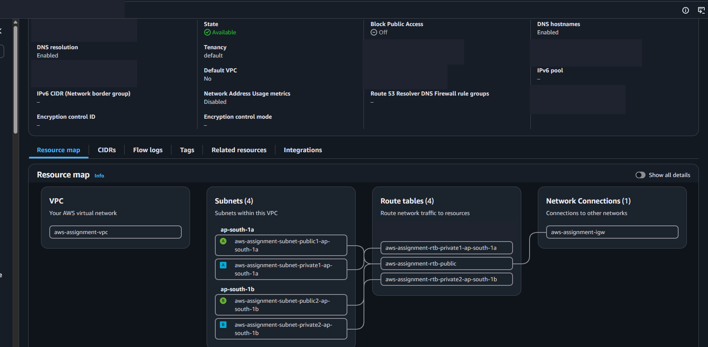

</details>

<details>
<summary><strong>Step 2 — Create the RDS DB subnet group</strong></summary>

### Purpose

Force RDS to use private subnets while meeting the RDS requirement for subnets in at least two Availability Zones.

### Steps

1. Open **RDS → Subnet groups → Create DB subnet group**.
2. Name it `aws-assignment-db-subnet-group`.
3. Select `aws-assignment-vpc`.
4. Select both private subnets, one in each Availability Zone.
5. Create the group and confirm that exactly the intended private subnets appear.

### Evidence

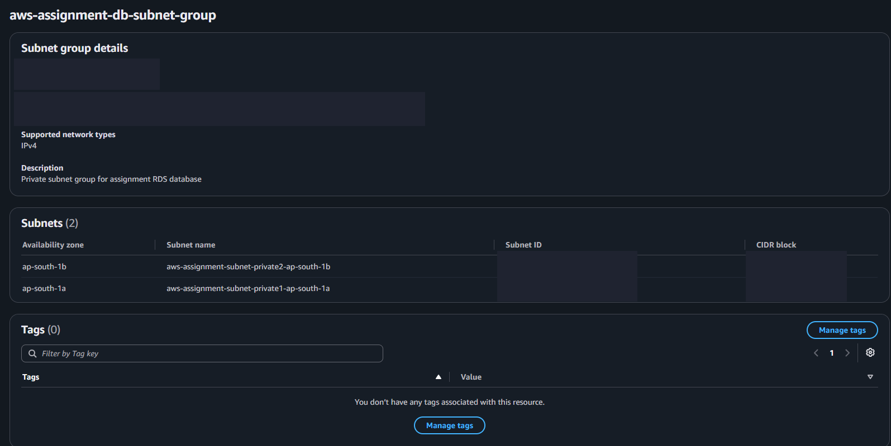

</details>

<details>
<summary><strong>Step 3 — Configure application and database security groups</strong></summary>

### Purpose

Allow application traffic while ensuring PostgreSQL is never exposed directly to the internet.

### Steps

1. Create `aws-assignment-app-sg` in the project VPC.
2. For the single-instance Beanstalk environment, allow HTTP port `80` to the application security group.
3. Create `aws-assignment-rds-sg` in the same VPC.
4. Add one inbound rule to the RDS group:
   - Type: `PostgreSQL`
   - Protocol: `TCP`
   - Port: `5432`
   - Source: `aws-assignment-app-sg`
5. Do not use an unrestricted IPv4 source for the database rule.
6. Keep default outbound access unless the application requires additional egress restrictions.

### Evidence

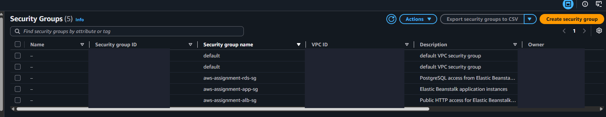

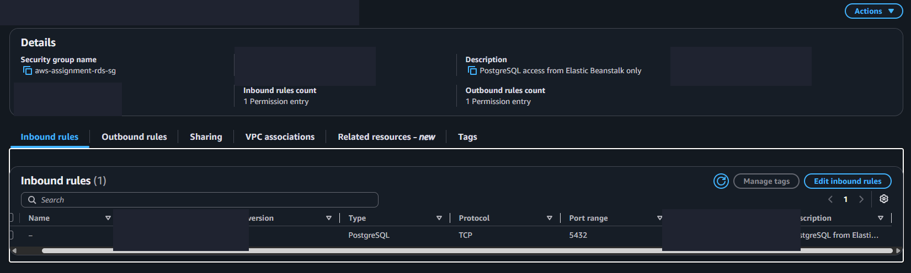

</details>

<details>
<summary><strong>Step 4 — Create the private Amazon RDS PostgreSQL database</strong></summary>

### Purpose

Provide a managed relational database for the Spring application without exposing the database publicly.

### Steps

1. Open **RDS → Databases → Create database**.
2. Select PostgreSQL and the free-tier/template option available to the account.
3. Use DB identifier `aws-assignment-postgres`.
4. Select `db.t4g.micro` (or `db.t3.micro` if required by the region/account).
5. Select single-AZ deployment.
6. Set the initial database name to `taskdb` and create an application user such as `appadmin`.
7. Store the password privately; do not put it in source code, README content, logs, or screenshots.
8. Under connectivity:
   - Select `aws-assignment-vpc`.
   - Select `aws-assignment-db-subnet-group`.
   - Set **Public access** to **No**.
   - Attach `aws-assignment-rds-sg`.
9. Use minimal storage and disable optional paid features that are not required.
10. Wait until the instance state becomes **Available**.

### Evidence

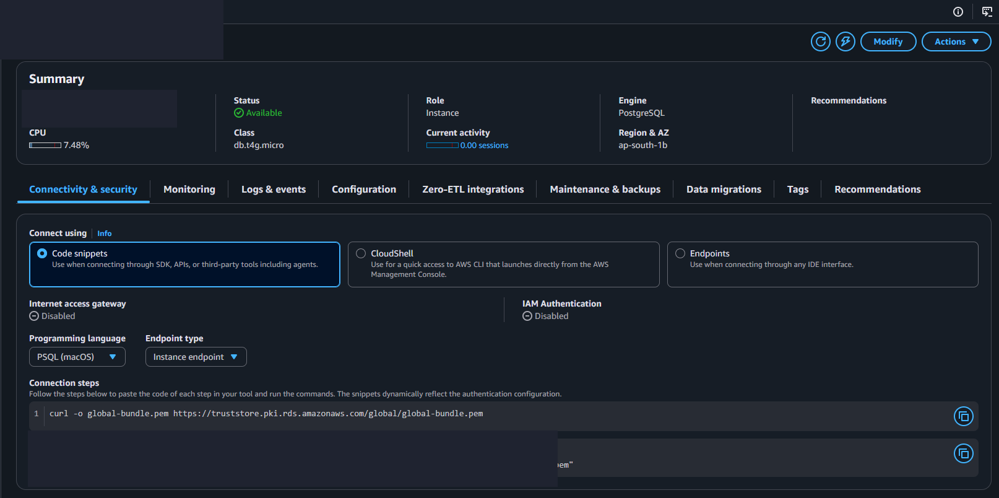

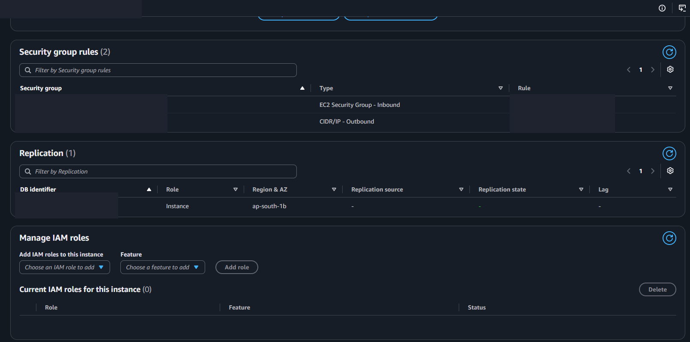

</details>

<details>
<summary><strong>Step 5 — Create the Elastic Beanstalk EC2 instance role</strong></summary>

### Purpose

Allow the EC2 instance managed by Elastic Beanstalk to perform the platform operations required for a Docker web environment.

### Steps

1. Open **IAM → Roles → Create role**.
2. Choose **AWS service** and the EC2 use case.
3. Name the role `aws-elasticbeanstalk-ec2-role`.
4. Attach the Elastic Beanstalk web-tier policy required by the selected platform.
5. For the Docker platform used in this project, the role also included the Elastic Beanstalk Docker/worker managed policies shown below.
6. Confirm that an EC2 instance profile exists for the role.

### Evidence

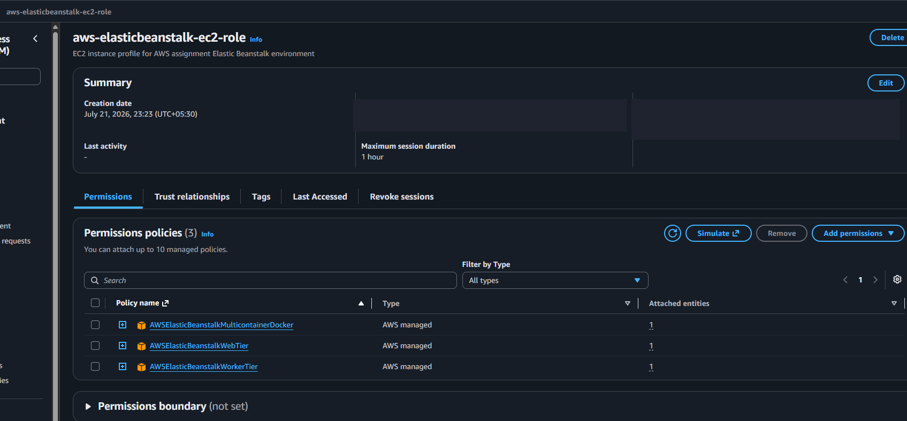

</details>

<details>
<summary><strong>Step 6 — Create the Elastic Beanstalk service role</strong></summary>

### Purpose

Allow Elastic Beanstalk itself to report enhanced health and manage supported platform updates.

### Steps

1. Create an IAM role trusted by Elastic Beanstalk.
2. Name it `aws-elasticbeanstalk-service-role`.
3. Attach:
   - `AWSElasticBeanstalkEnhancedHealth`
   - `AWSElasticBeanstalkManagedUpdatesCustomerRolePolicy`
4. Use this role as the service role when creating the environment.

### Evidence

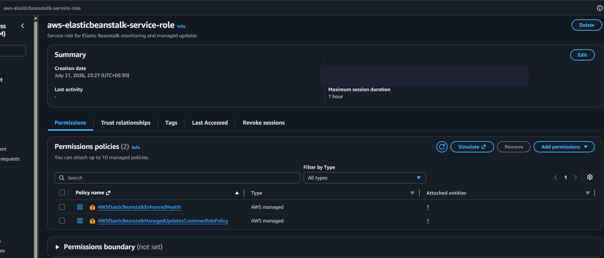

</details>

<details>
<summary><strong>Step 7 — Register GitHub Actions as an AWS OIDC provider</strong></summary>

### Purpose

Enable GitHub Actions to obtain short-lived AWS credentials without storing long-lived access keys in GitHub.

### Steps

1. Open **IAM → Identity providers → Add provider**.
2. Select **OpenID Connect**.
3. Set provider URL to `https://token.actions.githubusercontent.com`.
4. Set audience to `sts.amazonaws.com`.
5. Create the provider.

### Evidence

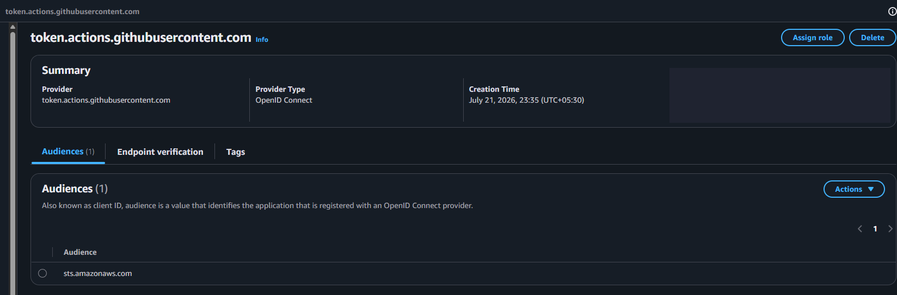

</details>

<details>
<summary><strong>Step 8 — Create the low-cost Elastic Beanstalk environment</strong></summary>

### Purpose

Deploy the application on AWS while avoiding the cost of a load balancer and multiple EC2 instances.

### Steps

1. Open **Elastic Beanstalk → Create application**.
2. Use application name `aws-assignment-task-api`.
3. Use environment name `aws-assignment-task-api-env`.
4. Select the Docker platform on 64-bit Amazon Linux 2023.
5. Choose **Single instance**, not high availability/load balanced.
6. Use a `t3.micro` EC2 instance.
7. Select the project VPC and a public subnet.
8. Enable a public IP for the single EC2 instance and attach `aws-assignment-app-sg`.
9. Select the EC2 instance profile and Elastic Beanstalk service role created earlier.
10. Configure the health-check path as `/actuator/health`.
11. Enable CloudWatch log streaming with one-day retention for this learning environment.
12. Add environment properties without exposing their values publicly:

    ```text
    DB_HOST=<RDS_ENDPOINT>
    DB_PORT=5432
    DB_NAME=taskdb
    DB_USERNAME=<DATABASE_USERNAME>
    DB_PASSWORD=<DATABASE_PASSWORD>
    PORT=8080
    SEED_DATA_ENABLED=true
    ```

### Evidence

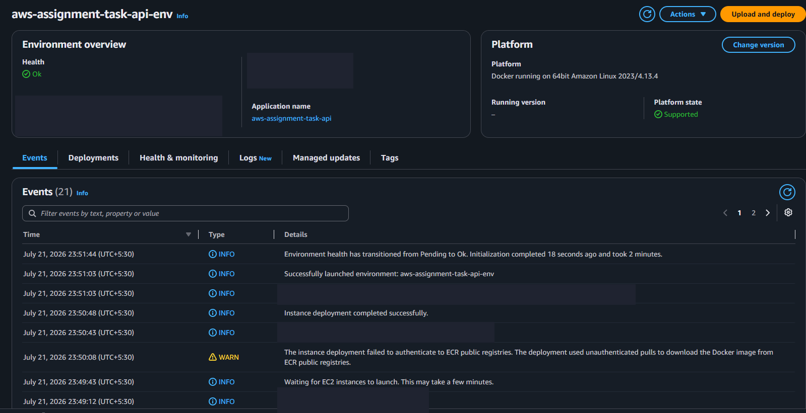

</details>

<details>
<summary><strong>Step 9 — Create the GitHub Actions deployment role</strong></summary>

### Purpose

Restrict AWS role assumption to the repository's `main` branch and grant the deployment workflow the permissions needed to publish an Elastic Beanstalk application version.

### Steps

1. Create IAM role `GitHubActionsElasticBeanstalkDeployRole` using the GitHub OIDC provider.
2. Restrict the trust relationship to the exact repository and `main` branch.
3. Replace every placeholder in the following complete trust policy before saving:

    ```json
    {
      "Version": "2012-10-17",
      "Statement": [
        {
          "Effect": "Allow",
          "Principal": {
            "Federated": "arn:aws:iam::<AWS_ACCOUNT_ID>:oidc-provider/token.actions.githubusercontent.com"
          },
          "Action": "sts:AssumeRoleWithWebIdentity",
          "Condition": {
            "StringEquals": {
              "token.actions.githubusercontent.com:aud": "sts.amazonaws.com",
              "token.actions.githubusercontent.com:sub": "repo:<GITHUB_OWNER>/<GITHUB_REPOSITORY>:ref:refs/heads/main"
            }
          }
        }
      ]
    }
    ```

4. This learning setup attached the AWS-managed `AdministratorAccess-AWSElasticBeanstalk` policy because Elastic Beanstalk updates call dependent CloudFormation, EC2, S3, and CloudWatch Logs APIs. The OIDC trust still limits role assumption to one repository branch.
5. For production, replace the managed policy with a CloudTrail-derived least-privilege policy scoped to the application, environment, deployment bucket, and Beanstalk-managed stack.

### Evidence

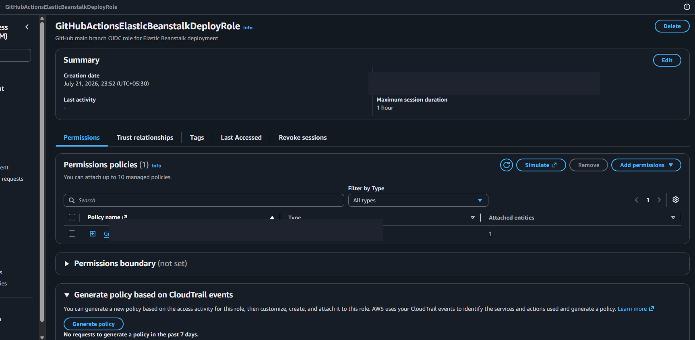

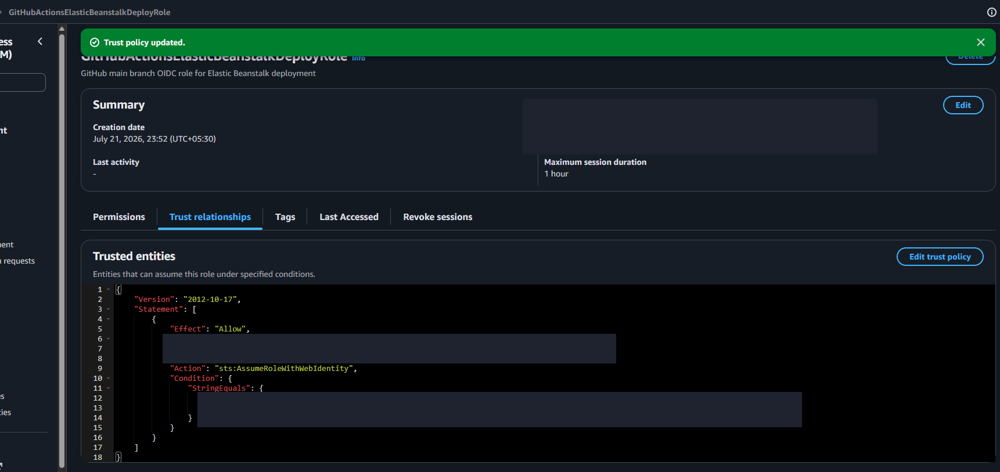

</details>

<details>
<summary><strong>Step 10 — Add the deployment role ARN to GitHub</strong></summary>

### Purpose

Provide the workflow with a non-secret role identifier while keeping credentials short-lived and generated at runtime.

### Steps

1. Open the GitHub repository.
2. Go to **Settings → Secrets and variables → Actions → Variables**.
3. Create repository variable `AWS_DEPLOY_ROLE_ARN`.
4. Set its value to:

   ```text
   arn:aws:iam::<AWS_ACCOUNT_ID>:role/GitHubActionsElasticBeanstalkDeployRole
   ```

5. Do not create `AWS_ACCESS_KEY_ID` or `AWS_SECRET_ACCESS_KEY` secrets.

### Evidence

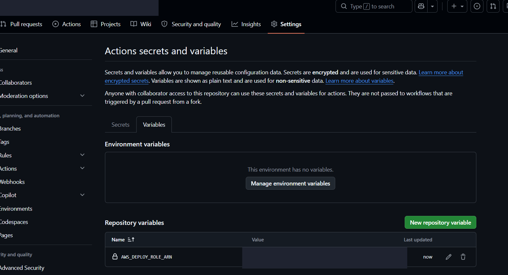

</details>

<details>
<summary><strong>Step 11 — Configure and run the GitHub Actions CI/CD pipeline</strong></summary>

### Purpose

Automatically test, build, package, deploy, and verify every application change pushed to `main`.

### Steps

1. Store the workflow at `.github/workflows/deploy.yml`.
2. On pull requests, run Maven verification and build the production Docker image.
3. On pushes to `main`, request an OIDC token and assume the AWS deployment role.
4. Upload the tested JAR as a short-lived GitHub artifact.
5. Package the JAR with `Dockerfile.elasticbeanstalk`.
6. Upload the bundle to the account's Elastic Beanstalk S3 bucket.
7. Create a retry-safe application version label.
8. Update the environment and wait for completion.
9. Verify that the deployed version matches the workflow version and that `/actuator/health` reports `UP`.

The complete workflow is available in [deploy.yml](.github/workflows/deploy.yml).

### Evidence

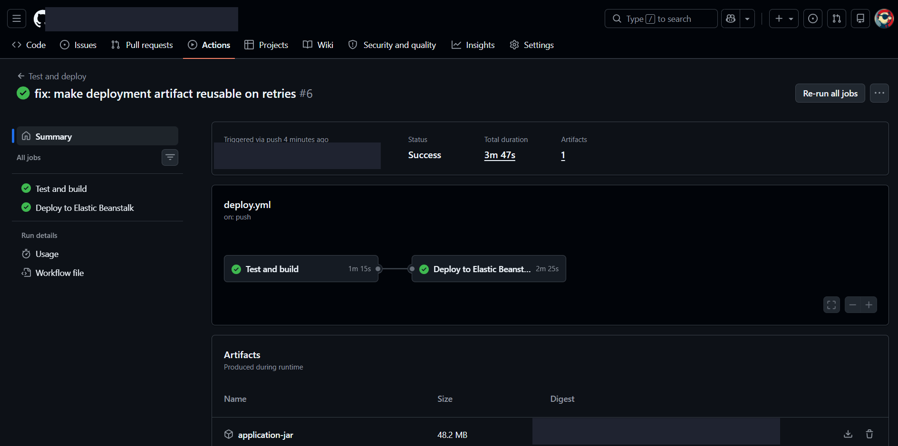

</details>

<details>
<summary><strong>Step 12 — Verify the deployed application and RDS connection</strong></summary>

### Purpose

Prove that the deployed container is running and that Spring can connect to the private PostgreSQL database.

### Steps

1. Open the generated Beanstalk URL without publishing it in the repository.
2. Request:

   ```text
   http://<ELASTIC_BEANSTALK_CNAME>/actuator/health
   ```

3. Confirm the overall status is `UP`.
4. Confirm the `db` component reports `UP` and identifies PostgreSQL.
5. Confirm no database endpoint, username, or password appears in the response.

### Evidence

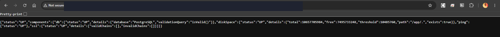

</details>

<details>
<summary><strong>Step 13 — Stream and review Elastic Beanstalk logs in CloudWatch</strong></summary>

### Purpose

Meet the logging requirement and make container deployment/startup failures diagnosable.

### Steps

1. In Elastic Beanstalk, enable instance log streaming to CloudWatch Logs.
2. Set a short retention period suitable for this learning environment.
3. Open **CloudWatch → Log groups**.
4. Select the Beanstalk environment log group and the latest instance stream.
5. Review `eb-engine.log` for Docker pull, image build, and deployment messages.
6. Never include environment-variable values or credentials in logs.

### Evidence

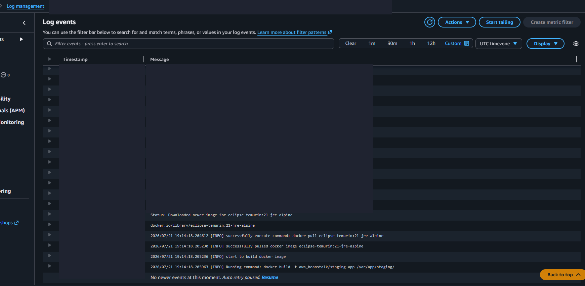

</details>

<details>
<summary><strong>Step 14 — Create the SQS queue and allow S3 notifications</strong></summary>

### Purpose

Buffer S3 upload events so Lambda can process them asynchronously and retry failures safely.

### Steps

1. Open **SQS → Create queue**.
2. Choose a Standard queue named `aws-assignment-upload-queue`.
3. Use a 30-second visibility timeout and one-day message retention.
4. Enable SQS-managed server-side encryption.
5. Edit the queue access policy and replace every placeholder in this complete JSON:

    ```json
    {
      "Version": "2012-10-17",
      "Id": "S3UploadNotificationPolicy",
      "Statement": [
        {
          "Sid": "AllowS3ToSendUploadNotifications",
          "Effect": "Allow",
          "Principal": {
            "Service": "s3.amazonaws.com"
          },
          "Action": "sqs:SendMessage",
          "Resource": "arn:aws:sqs:<AWS_REGION>:<AWS_ACCOUNT_ID>:<SQS_QUEUE_NAME>",
          "Condition": {
            "ArnLike": {
              "aws:SourceArn": "arn:aws:s3:*:*:<UNIQUE_BUCKET_NAME>"
            },
            "StringEquals": {
              "aws:SourceAccount": "<AWS_ACCOUNT_ID>"
            }
          }
        }
      ]
    }
    ```

The source-account and source-bucket conditions prevent unrelated S3 buckets from sending messages to the queue.

</details>

<details>
<summary><strong>Step 15 — Create the S3 bucket and S3-to-SQS event notification</strong></summary>

### Purpose

Send an event to SQS whenever a file is uploaded under the bucket's `uploads/` prefix.

### Steps

1. Create a general-purpose S3 bucket in the same region as SQS and Lambda.
2. Keep default S3 server-side encryption enabled.
3. Open **Properties → Event notifications → Create event notification**.
4. Use name `send-uploads-to-sqs`.
5. Select **All object create events**.
6. Set prefix to `uploads/`.
7. Select the Standard SQS queue created earlier.
8. Save the event notification. If validation fails, correct the SQS queue policy before retrying.

### Evidence

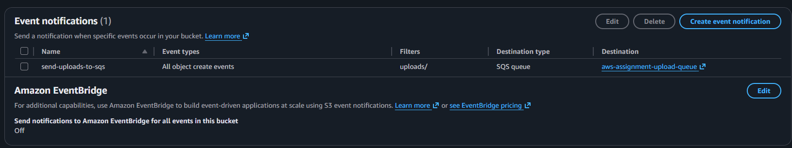

</details>

<details>
<summary><strong>Step 16 — Allow public read only for S3 static files</strong></summary>

### Purpose

Meet the public-static-file requirement without exposing uploads or every object in the bucket.

### Steps

1. Disable bucket-level block-public-access only for the deliberately public `static/` prefix used in this project.
2. Do not grant public write, list, delete, or ACL permissions.
3. Add this complete bucket policy after replacing `<UNIQUE_BUCKET_NAME>`:

    ```json
    {
      "Version": "2012-10-17",
      "Statement": [
        {
          "Sid": "PublicReadStaticFiles",
          "Effect": "Allow",
          "Principal": "*",
          "Action": "s3:GetObject",
          "Resource": "arn:aws:s3:::<UNIQUE_BUCKET_NAME>/static/*"
        }
      ]
    }
    ```

4. Confirm the resource ends in `/static/*`; do not use a bucket-wide `/*` resource.

### Evidence

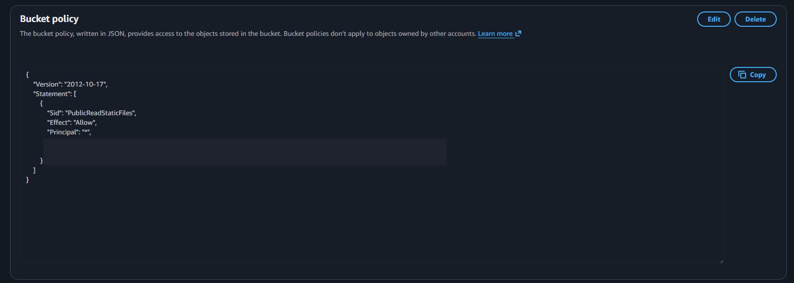

</details>

<details>
<summary><strong>Step 17 — Upload and verify the public static file</strong></summary>

### Purpose

Demonstrate that static content is publicly readable while the upload-processing prefix remains separate.

### Steps

1. Upload `static/index.html` from this repository using the object key `static/index.html`.
2. Open the object URL:

   ```text
   https://<UNIQUE_BUCKET_NAME>.s3.<AWS_REGION>.amazonaws.com/static/index.html
   ```

3. Confirm the HTML page loads without AWS credentials.
4. Do not publish the live bucket URL or an account-derived bucket name in a public README.

### Evidence

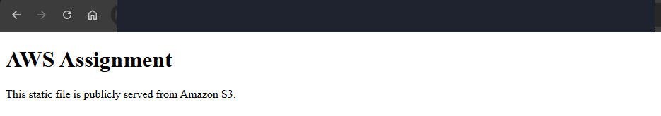

</details>

<details>
<summary><strong>Step 18 — Create the Lambda SQS event processor</strong></summary>

### Purpose

Consume SQS messages, parse the nested S3 object-created event, and write useful records to CloudWatch Logs.

### Steps

1. Create function `aws-assignment-sqs-logger`.
2. Choose Python 3.13, ARM64, and the default 128 MB memory allocation.
3. Create a basic Lambda execution role.
4. Paste and deploy [lambda_function.py](lambda/sqs_logger/lambda_function.py).
5. Attach AWS-managed policy `AWSLambdaSQSQueueExecutionRole` to the execution role.
6. Add the SQS queue as an event source with:
   - Batch size: `10`
   - Batch window: `0`
   - Trigger enabled: `Yes`
   - Report batch item failures: `Yes`
7. Run the local Lambda unit test:

   ```bash
   python -m unittest discover -s lambda/sqs_logger -v
   ```

The handler URL-decodes object keys and returns `batchItemFailures` so Lambda can retry only failed SQS messages.

### Evidence

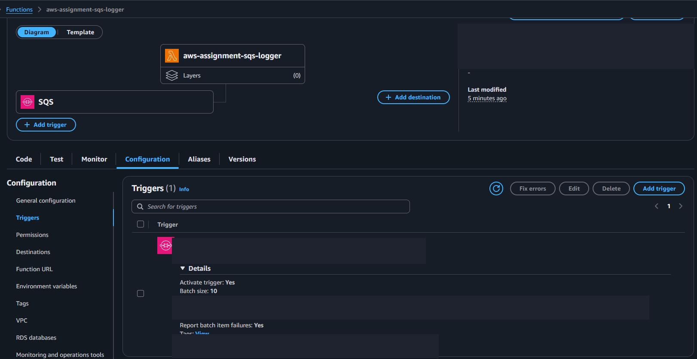

</details>

<details>
<summary><strong>Step 19 — Test S3 to SQS to Lambda to CloudWatch end to end</strong></summary>

### Purpose

Prove the complete asynchronous automation path works rather than testing each resource in isolation.

### Steps

1. Upload a small file with object key `uploads/index.html`.
2. Wait for S3 to send the event to SQS and for Lambda to poll the queue.
3. Open **Lambda → Monitor → View CloudWatch logs**.
4. Open the newest log stream.
5. Confirm an entry contains:

   ```text
   event=ObjectCreated:Put ... key=uploads/index.html
   ```

6. Confirm no database credential, account number, or sensitive URL is logged.

### Evidence

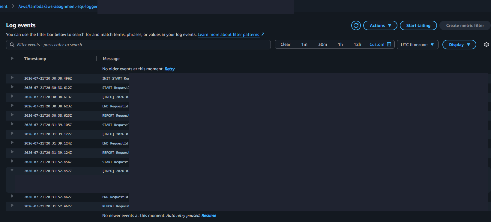

</details>

<details>
<summary><strong>Step 20 — Create the Elastic Beanstalk EC2 CPU alarm</strong></summary>

### Purpose

Alert when the EC2 instance underlying the single-instance Elastic Beanstalk environment experiences sustained high CPU usage.

### Steps

1. Open **CloudWatch → Alarms → Create alarm**.
2. Select **EC2 → Per-Instance Metrics**.
3. Choose `CPUUtilization` for the current Beanstalk EC2 instance.
4. Configure:
   - Statistic: `Average`
   - Period: `5 minutes`
   - Static threshold: `Greater than or equal to 80`
   - Datapoints to alarm: `1 out of 1`
5. Do not create an SNS topic for this minimal-cost learning setup.
6. Name the alarm `aws-assignment-eb-high-cpu`.

### Evidence

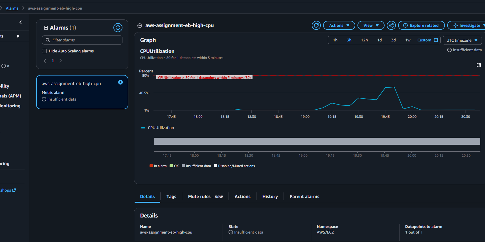

</details>

<details>
<summary><strong>Step 21 — Create the RDS CPU alarm</strong></summary>

### Purpose

Monitor the database independently from the application host and identify database CPU saturation.

### Steps

1. Open **CloudWatch → Alarms → Create alarm**.
2. Select **RDS → Per-Database Metrics**.
3. Choose `CPUUtilization` for `aws-assignment-postgres`.
4. Configure:
   - Statistic: `Average`
   - Period: `5 minutes`
   - Static threshold: `Greater than or equal to 80`
   - Datapoints to alarm: `1 out of 1`
5. Do not create an SNS topic for this minimal-cost learning setup.
6. Name the alarm `aws-assignment-rds-high-cpu`.

### Evidence

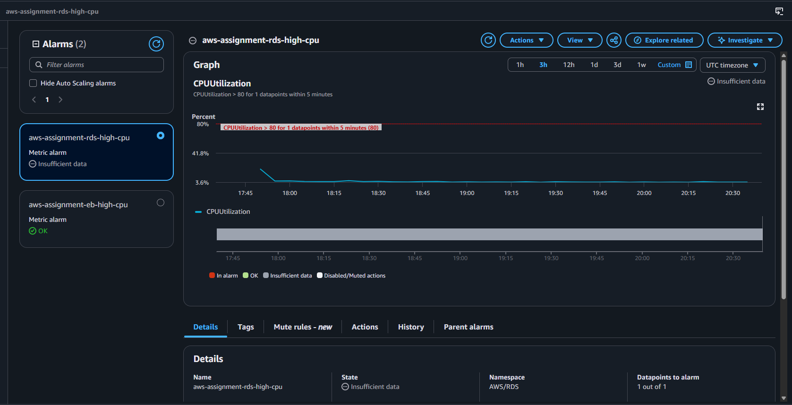

</details>

<details>
<summary><strong>Step 22 — Review Elastic Beanstalk monitoring metrics</strong></summary>

### Purpose

Demonstrate that the environment publishes operational metrics to CloudWatch and that CPU and network behavior can be reviewed.

### Steps

1. Open the Elastic Beanstalk environment.
2. Select **Health & monitoring**.
3. Choose a recent time range such as three hours.
4. Review environment health, CPU utilization, network in, and network out.
5. Correlate changes with deployments and health-check requests.

### Evidence

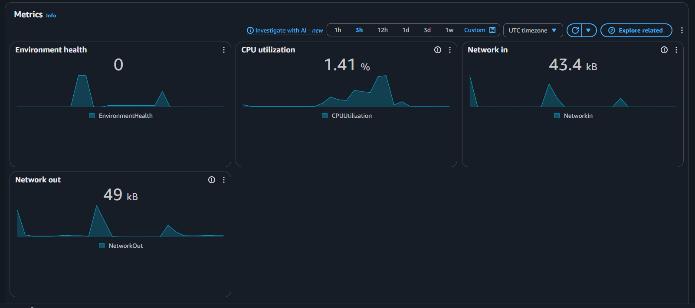

</details>

<details>
<summary><strong>Step 23 — Review RDS monitoring metrics</strong></summary>

### Purpose

Demonstrate that RDS publishes CloudWatch metrics for database load, connections, memory, storage, latency, throughput, and I/O.

### Steps

1. Open **RDS → Databases → aws-assignment-postgres**.
2. Select **Monitoring**.
3. Choose a recent time range.
4. Review `CPUUtilization`, `DatabaseConnections`, `FreeableMemory`, and `FreeStorageSpace`.
5. Review read/write operations, latency, and throughput for additional evidence.

### Evidence

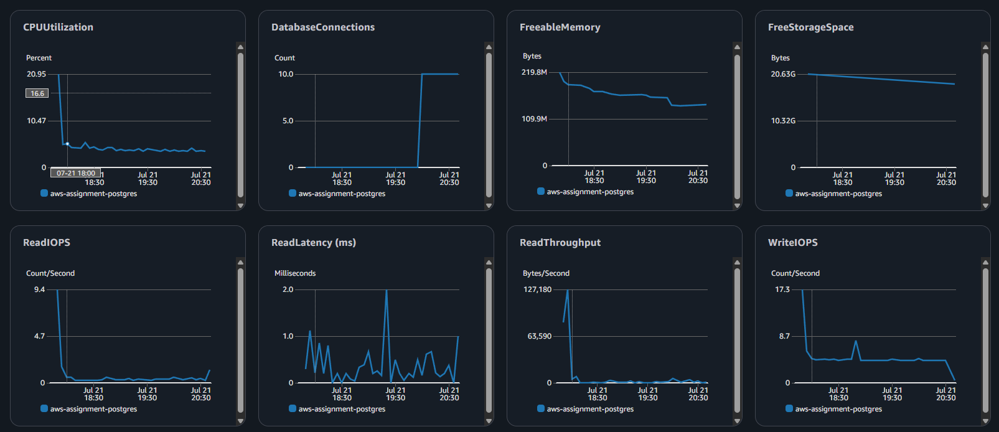

</details>

## Verification commands

Run the Spring test suite with local Maven:

```bash
mvn --batch-mode --no-transfer-progress test
```

Or use a Java 21 Maven container:

```bash
docker run --rm \
  -v maven-cache:/root/.m2 \
  -v "$PWD:/workspace" \
  -w /workspace \
  maven:3.9.11-eclipse-temurin-21 \
  mvn --batch-mode --no-transfer-progress test
```

Run the Lambda test:

```bash
python -m unittest discover -s lambda/sqs_logger -v
```

Verify the Docker image:

```bash
docker build -t aws-assignment-task-api:local .
```

## Repository contents

```text
.github/workflows/deploy.yml       GitHub Actions CI/CD pipeline
src/main                           Spring Boot application
src/test                           Spring integration and context tests
lambda/sqs_logger                  Lambda handler and unit test
static/index.html                  Public S3 static-file example
Dockerfile                         Full multi-stage application image
Dockerfile.elasticbeanstalk        Lightweight Beanstalk runtime image
docker-compose.yml                 Local PostgreSQL and application stack
docs/screenshots                   Public-safe evidence embedded in this README
```

## Cleanup when finished

To avoid ongoing charges, remove resources when the learning environment is no longer needed:

1. Terminate the Elastic Beanstalk environment and delete unused application versions/source bundles.
2. Delete the RDS instance and choose whether a final snapshot is needed.
3. Empty and delete the project S3 bucket.
4. Delete the SQS queue and Lambda function.
5. Delete the two CloudWatch alarms and project log groups if no longer required.
6. Delete GitHub deployment IAM roles/policies and the OIDC provider if they are not used elsewhere.
7. Delete the custom VPC after all dependent resources have been removed.
